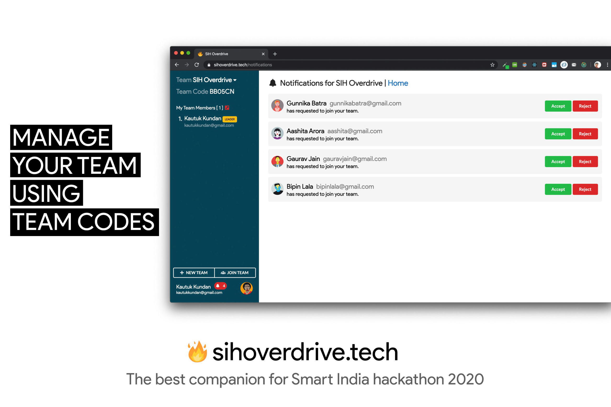

# SIH Overdrive Backend


## Getting Started

[Me](https://github.com/GauravJain98) and my friend [Kautuk Kundan](https://github.com/Kautukkundan/) have developed an application (https://sih-overdrive.netlify.app/) with intention of providing a companion app for aspiring participants of SIH 2020. 

In SIH 2019, as keen participants me and  decided to go through all the problem statements put up on the portal. There was not an efficient way of dividing the task among the team members. So we manually created a word document of all the problem statements in tabular form, printed the documents and handed the pages to each other. 
There was still an issue of making notes as we had to write on the backside of the printed sheets. After several revisions and discussions the sheets ended up scribbled and messy so we shortlisted a few problems and reprinted them. 
The major problem we faced was unorganised division, mess of papers and not to mention avoidable wastage of paper. 

## Key-Features of the application
1. A modern look and feel.
2. Ability to form teams and invite other team members.
3. Ability to mark progress on problem statements (read, unread, rejected, selected, in-progress).
4. Ability to make notes right beside the problem statement and view notes made by other team mates. 
5. Ability to search for specific keywords in problem statements, organisations and various other kinds of filters.

### Screenshots

<p float="left">
  
  
</p>
<p float="left">
  
  
</p>

### Set Up

```
pip install -r requirements.txt
python manage.py makemigrations 
python manage.py migrate 
```

## Deployment

```
python manage.py runserver
```

## Built With

* [Django](https://www.djangoproject.com/) - The Backend Framework
* [PostgreSQL](https://www.postgresql.org/) - Production Database
* [SQLite](https://www.sqlite.org/index.html) - Development Database
* [Google Analytics](https://analytics.google.com/analytics/web/) - Analytics

## Authors

* **Gaurav Jain** - *Backend Developer* - [GauravJain98](https://github.com/GauravJain98)
* **Kautuk Kundan** - *Frontend Developer* - [Kautukkundan](https://github.com/Kautukkundan)

## License

This project is licensed under the MIT License - see the [LICENSE.md](LICENSE.md) file for details
